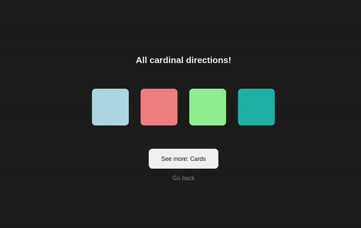
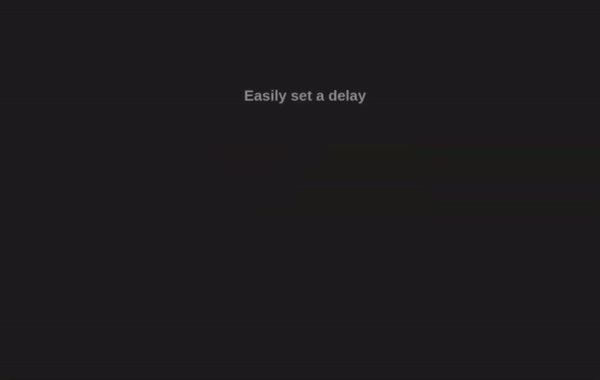
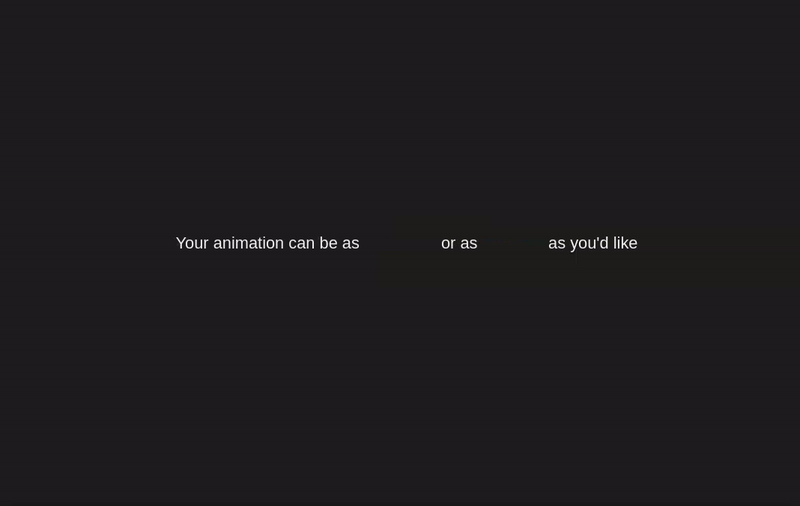

# Simple scroll animations


- 🌐 [Demo website](https://michal-skoula.github.io/simple-scroll-animations)
- 🔗 [My WIP personal website using this library](https://michal-skoula.github.io/website)

Tailwind inspired way to create simple scroll animations for your website. Extremely easy to use for someone who wants to spice up their website presentation. 

I made this for my personal website, as I really only needed simple animations and this was the most comfortable way I found of making them.
``` HTML
<h1 class="animate once left-to-right delay200">And that's it!</h1>
```
## 💎 Highlights
- Every setting fully customizable
- Super simple to use, only need to remember a few classes
- Mostly CSS only and utilizing the intersectionObserver API for applying the animations
- Small bundle size of 3.2kB

## 🏗️ Installation
### 1. Link CSS and JS in your project
Add the following code in `<head>`:
``` HTML
<link rel="stylesheet" href="https://cdn.jsdelivr.net/gh/Michal-Skoula/simple-scroll-animations@master/release/latest/styles.css">
<script defer src="https://cdn.jsdelivr.net/gh/Michal-Skoula/simple-scroll-animations@master/release/latest/script.js"></script>
``` 
### 2. Add `animate` class to elements you want to animate
``` HTML
<h1 class="animate">This is now animated!</h1>
```
### 3. Add aditional classes to modify the behaviour
``` HTML
<h1 class="animate once left-to-right delay100">Left to right animation with a delay happening once</h1>
```
*For a more detailed overview of available classes, see **Configuration**.*

### 4. Change settings to suit your preferences
This library comes with a few settings to tweak to your liking, which you change by editing CSS variables inside the document `:root`. You can copy the following code inside your CSS should you want to change any values. **You do not need to change any of these values if you don't want to.**
``` CSS
:root:root {
  --reanimate-on-scroll-by-default: 0;
  --default-animation-duration: 500ms; 
  --staggered-step-amount:250ms; 
  --delay-step-amount: 250ms; 
  --blur-strength: 3px; 
  --translate-amount-x: 40%;
  --translate-amount-y: 40%;
}
```  
Note: In order to change these setting, use `:root:root` for a higher specificity than the default settings.

A more detailed description of the available settings can be seen in **Configuration**.

## ⚙️ Configuration
### Notes
If your element has animations and transitions on it already, this library may not play nice. I recommend wrapping the element in a `<div>` or `<span>` and putting the animations on that to resolve any issues.
#### ❌ Don't:
``` HTML
<a class="animate bottom-to-top delay100 button-primary">Button</a> 
```
#### ✅ Do:
``` HTML
<div class="animate bottom-to-top delay100">
  <a class=" button-primary">Button</a>
</div>
```

### Settings
``` CSS
:root {
  /* Sets if by default animations should play every time they are loaded (1) or only once (0) */
  --reanimate-on-scroll-by-default: 1;

  /* Default duration for all animations. Can be overriden by setting a duration100-1000 value. */
  --default-animation-duration: 500ms; 

  /* For duration100-1000, what the step values should be.  */
  /* For a value of200ms, duration200 = 400ms, duration300 = 600ms and so on.  */
  /* Equation is: calc(var(--staggered-step-amount) * var(--duration)); */
  --staggered-step-amount:250ms;

  /* Sets the values for each step of the animation in a list and delay100-1000 values. */
  /* For a value of 150ms, delay100 = 150ms, delay300 = 450ms and so on.  */
  /* Equation is: calc(var(--delay-step-amount) * var(--delay) */
  --delay-step-amount: 250ms;

  /* How strong the blur is when elements are animating in. Can be turned off. */
  --blur-strength: 3px; 

  /* How much elements should be moved when animated e.g. right-to-left. */
  --translate-amount-x: 40%;
  --translate-amount-y: 40%;
}
```
### Available animation types
- `fade-in` (default)
- `right-to-left`
- `left-to-right`
- `top-to-bottom`
- `bottom-to-top`

### Available Classes
- `animate` - Makes an element be animatable. This is mandatory for every element that is to be animated.
- `name-of-animation` - Type of animation which should display on scroll, see **Animation types**.
- `once / always` - If the animation should play once or every time it enters the viewport.
- `staggered`- Used on lists of elements, such as cards, buttons, menu items etc.
- `noblur` - Removes blur from the animation.
- `delay100-1000` - Set a custom delay for when the animation should play for. Doesn't work with `staggered`.
- `duration100-1000` - Set a custom duration for how long the animation should play for.

## 🌳 Examples
### Different directions

``` HTML
<h2 class="animate delay200">All cardinal directions!</h2>
<div class="flex-container">
  <div class="block animate left-to-right"></div>
  <div class="block animate top-to-bottom"></div>
  <div class="block animate bottom-to-top"></div>
  <div class="block animate right-to-left"></div>
</div>
<div class="animate fade-in delay300 column">
  <a href="#cards-showcase" class="button">See more: Cards</a>
  <a href="#hero">Go back</a>
</div>
```
---
### Staggered elements (cards or lists)

``` HTML
<h2 class="animate delay200">Sick staggered cards with one class</h2>
<div class="flex-container">
  <div class="block animate left-to-right staggered"></div>
  <div class="block animate left-to-right staggered"></div>
  <div class="block animate left-to-right staggered"></div>
  <div class="block animate left-to-right staggered"></div>
</div>
<div class="animate fade-in delay400 column">
  <a href=""></a>
  <a href="#delay-showcase" class="button">See more: Setting a delay</a>
  <a href="#side-to-side-showcase">Go back</a>
</div> 
```
---
### Delayed animations

``` HTML
<h2 class="animate">Easily set a delay</h2>
<div class="flex-container delay-grid">
  <span class="animate delay100">You</span>
  <span class="animate delay500">just</span>
  <span class="animate delay300">set</span>
  <span class="animate delay200">a</span>
  <span class="animate delay700">value</span>
  <span class="animate delay600">from</span>
  <span class="animate delay900">100</span>
  <span class="animate delay400">to</span>
  <span class="animate delay1000">1000</span>
</div>
<div class="animate fade-in delay100 column">
  <a href="#duration-showcase" class="button">See more: Setting a duration</a>
  <a href="#cards-showcase">Go back</a>
</div> 
```
---
### Long and short animations

``` HTML
<h2 class="animate">Set an animation duration</h2>
<p>Your animation can be as <span class="animate bottom-to-top delay300 duration100">short</span> or as <span class="animate top-to-bottom delay400 duration1000">long</span> as you'd like</p>
<div class="animate fade-in delay100 column">
  <a href="#installation" class="button">Installation</a>
  <a href="#delay-showcase">Go back</a>
</div> 
```
